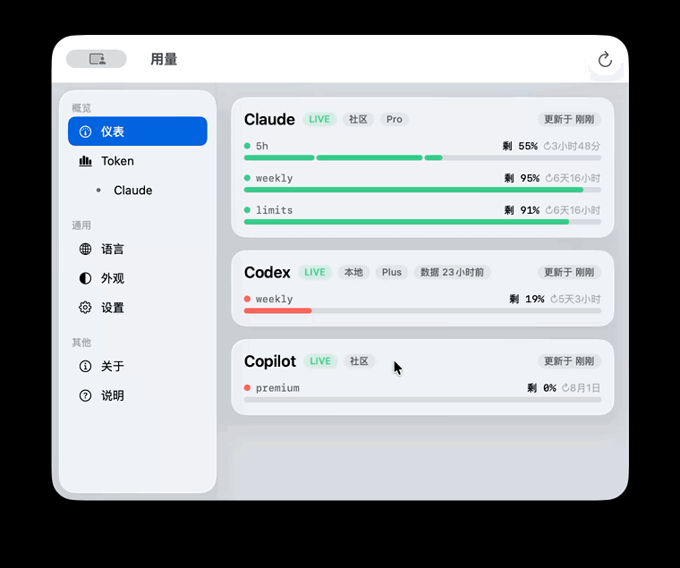

# Tokenitor · AI Usage Tracker

[中文](README.md) · **English**

A native macOS menu-bar app that shows the **remaining quota** of your AI coding tools at a glance and sends a system notification when any of them runs low. It also has a separate **Token usage** page that reads your local session files and leads with **estimated cost** — KPI tiles (cost / tokens / requests), a grouped input-cache-output trend chart with axis ticks, a per-model table combining tokens and cost, and a cache-savings insight line. Subscription tiers (Claude Max/Pro, Codex Plus/Pro, Copilot Pro/Business) show as chips **only when the locally readable value maps to a real tier** — unknown or account-type values are never shown.

Supported today: **Claude**, **Codex**, **Gemini CLI**, **GitHub Copilot**. Each AI is identified by its **name only** — no third-party brand logos. Only the tools you actually use (installed / logged in) are shown; the rest are hidden automatically.

<p align="center">
  
</p>

<p align="center">
  
</p>

## What it does

Tokenitor lives in the **menu bar**. Left-click opens a compact usage popover; right-click shows a small menu. Clicking an item opens the **full window** — a standard macOS `NavigationSplitView` (the same layout as System Settings) with a sidebar (Dashboard / Token / Language / Appearance / Settings / About / Help) and a grouped `Form` settings page; you can also open it from the Dock icon. Each AI is a card labeled with its **name only** (no logos), a colored progress bar, remaining %, and a reset countdown. Light/dark follows the system or can be switched manually. Hovering the notch shows a compact panel. Standard macOS menus are in place — View (Dashboard ⌘1 / Token Usage ⌘2 / Refresh ⌘R), Window (⌘M/⌘W), and Help (guide, GitHub, check for updates) — and refresh lives in the window toolbar with a native progress spinner while fetching.

## Three-minute start

1. **Install**: [download the DMG](https://github.com/CSzcm8788/Tokenitor/releases/latest) and drag it into Applications, or one-line `curl -fsSL https://raw.githubusercontent.com/CSzcm8788/Tokenitor/main/get.sh | bash`.
2. **Look**: a ◔ icon appears in the menu bar — left-click for the glance popover. Codex / Gemini cards **show up automatically** (fully local, zero config); for Claude / Copilot, flip the toggle in Settings and authorize once (community APIs, off by default).
3. **Read**: bars show remaining quota — the 5-hour window carries tick marks at 20%/50% · green/amber/red = healthy/low/critical · `LIVE`/`Cached`/`Offline` = data freshness · ↻ = reset countdown. A system notification fires when remaining drops below your threshold.

Odd readings or a dead endpoint? [Open an issue](https://github.com/CSzcm8788/Tokenitor/issues/new/choose) — the template walks you through the key info.

## Where the data comes from

| Tool | Source | Notes |
|------|--------|-------|
| Claude | `https://api.anthropic.com/api/oauth/usage` | **Community API** (not officially documented) — an OAuth usage endpoint returning 5h / weekly used-% and reset times. This is **account-level shared usage**, so one reading covers the Claude desktop app, web, and Claude Code. Token is read from `~/.claude/.credentials.json`, falling back to the macOS Keychain — **read-only: Tokenitor never refreshes Claude Code's tokens on its behalf** (that would rotate its refresh token and log it out); when the token expires, just run any request in Claude Code and hit refresh. **⚠️ Advanced · off by default:** this endpoint uses subscription credentials that, per Anthropic's terms, are intended for Claude Code / Claude.ai only; third-party use may violate those terms. Enable it only after confirming the in-app risk prompt. |
| Codex | `~/.codex/sessions/**/*.jsonl` | Parses `rate_limits` from recent session files (primary = 5h, secondary = weekly). Fully local, no network. |
| Gemini CLI | `~/.gemini/tmp/<user>/logs.json` | A **local estimate** from today’s request count (this Mac’s CLI only), resetting at local midnight. The official daily limit varies by account type (~250–2000) and isn’t readable locally, so the divisor is **adjustable in Settings** (default 1000) and labelled as an estimate. Note: since June 2026 Google moved personal accounts from the legacy Gemini CLI to Antigravity CLI (`agy`), whose usage isn’t written to `~/.gemini`; this card only appears when local activity is seen in the last 36h. |
| GitHub Copilot | `https://api.github.com/copilot_internal/user` | Uses the `gho_` login token in `~/.config/github-copilot/` to request GitHub's built-in endpoint and read `quota_snapshots.premium_interactions` (monthly premium usage remaining %, resets on the 1st UTC). Individual Pro can use the token directly. **Non-official internal endpoint**, off by default (opt-in); degrades gracefully if it changes. |

> ⚠️ Claude / Copilot use non-official endpoints (off by default, opt-in) that may change or break at any time. When that happens the row shows a gray status and degrades gracefully (the fully-local Codex / Gemini are unaffected). Turn on **Settings → Debug dump** to write raw JSON to `~/.tokenitor/debug/` for troubleshooting.

## Download & install

**Download (recommended):** grab `Tokenitor.dmg` from [Releases](https://github.com/CSzcm8788/Tokenitor/releases/latest), open it, drag Tokenitor into Applications, and double-click to run (notarized by Apple — no Gatekeeper prompt). Requires **macOS 13 (Ventura) or later**.

**Homebrew:**

```bash
brew install --cask CSzcm8788/tap/tokenitor
```

**Build from source:** requires macOS 13+ and the Xcode command-line tools (`xcode-select --install`; **no need to open Xcode**).

```bash
cd Tokenitor
bash install.sh          # build + install to /Applications + launch
```

Uninstall: `bash uninstall.sh`. Build only: `bash build.sh && open dist/Tokenitor.app`. First launch may be blocked by Gatekeeper — right-click → Open.

Run the unit tests with `swift test` (redaction, tolerant JSON parsing, formatting, pricing); CI runs build + tests on every push.

Enable **Launch at login** from the in-app Settings (native login item via `SMAppService`).

## Command line (CLI)

The same app doubles as a read-only CLI: prints current quotas once and exits — for scripts, tmux status bars, and automation (identical data pipeline as the GUI).

```bash
/Applications/Tokenitor.app/Contents/MacOS/Tokenitor --cli          # human-readable
/Applications/Tokenitor.app/Contents/MacOS/Tokenitor --cli --json   # stable-keyed JSON

# optional short command
sudo ln -s "/Applications/Tokenitor.app/Contents/MacOS/Tokenitor" /usr/local/bin/tokenitor
tokenitor --cli
```

> Note: Claude / Copilot read Keychain credentials in CLI mode too — the first terminal call may show an "allow Keychain access" prompt; without it only local sources (Codex / Gemini) are printed.

## Token usage page

The sidebar’s **Token** item (or **⌘2**) opens a separate **Token usage** page: today's token spend per tool, split by model, estimated equivalent cost, and a 7-day trend (persisted to `~/.tokenitor/token-history.json`). Purely local, no network.

| Tool | Source |
|------|--------|
| Codex | `~/.codex/sessions/**/*.jsonl` — per-turn `last_token_usage`, split by model |
| Claude Code | `~/.claude/projects/**/*.jsonl` — `message.usage` per assistant message. **Only the Claude Code terminal** writes tokens locally; the Claude desktop app / web do not. |
| OpenCode | `~/.local/share/opencode/opencode.db` — `tokens` + `cost` from the `message` table (uses OpenCode's own cost, accurate even for models outside the price table) |

> Cost is an estimated "equivalent spend" from the **LiteLLM community price table** (MIT, 2,900+ models, bundled as a snapshot and synced with upstream at release time — never at runtime), not your actual subscription bill; models without pricing show "—".

**The Usage page and Token page are two independent data sources.** The Settings toggles only control the Usage page (quota %); the Token page ignores them and simply scans whatever local token files exist.

## Branding

The app **bundles and displays no third-party brand logos** — each AI is identified by its **name only**. This eliminates the trademark-distribution risk of shipping brand images at the root.

## Privacy

Everything is processed locally. Credentials are used only to talk directly to each vendor's official domain; local session files are read-only. Nothing is uploaded to any third party. See [PRIVACY.md](PRIVACY.md) for exactly what is stored, where, and for how long.

## License

[MIT](LICENSE) © 2026 CSzcm8788. Free to use / modify / distribute (including commercially); keep the copyright notice. Provided "as is" without warranty.

## Disclaimer

Tokenitor is an independent project with **no affiliation, partnership, or official relationship** with Anthropic / OpenAI / Google / GitHub·Microsoft or their products (Claude, Codex, Gemini, Copilot). It uses each service's **name only** as a nominative identifier and bundles no third-party logo images; names/trademarks belong to their respective owners. Reads local data only; makes no guarantee of accuracy; use at your own risk. Full terms in [DISCLAIMER.md](DISCLAIMER.md).
