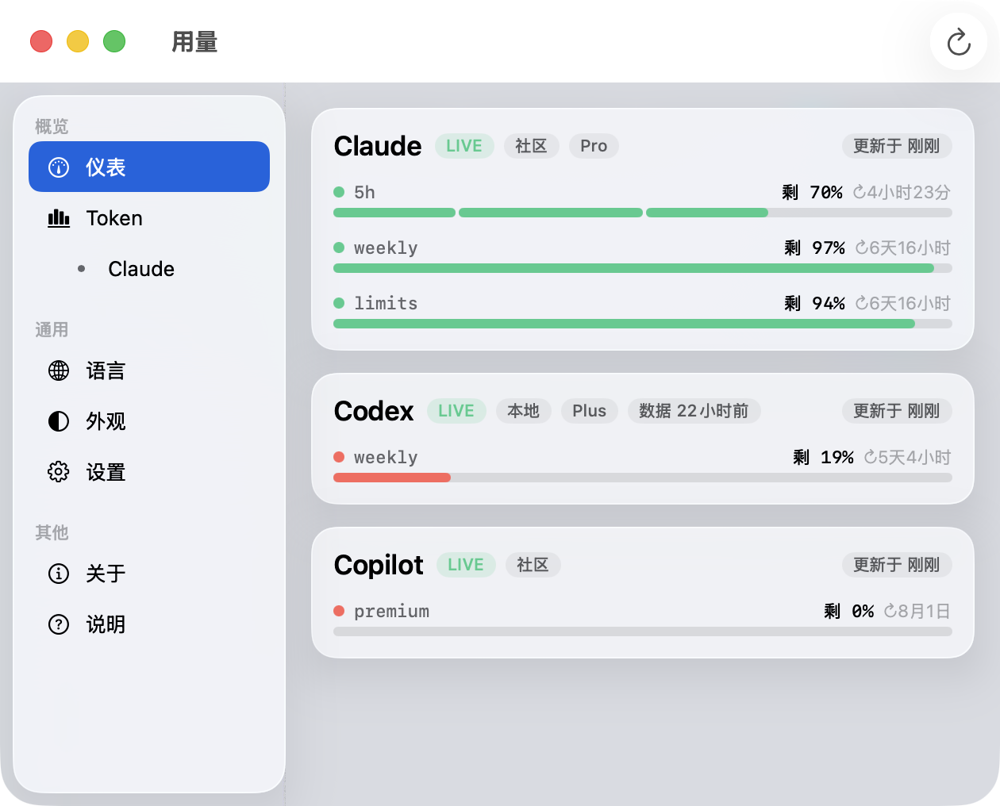
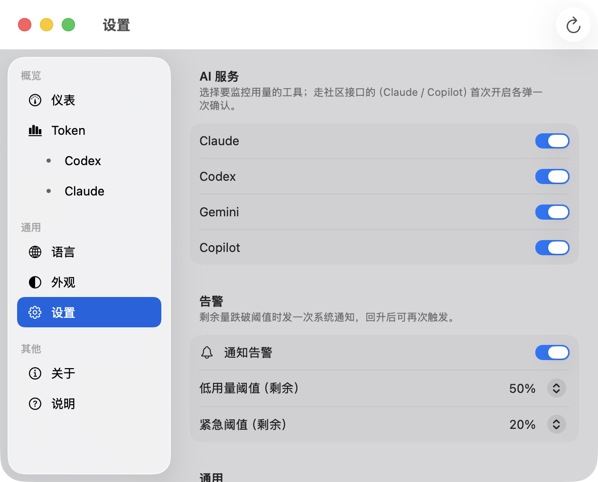
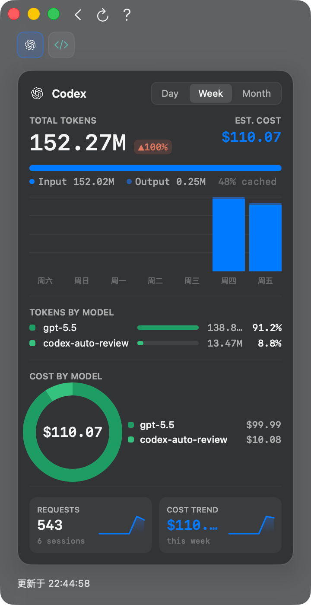

# Tokenitor · AI Usage Tracker

**中文** · [English](README.en.md)

一个原生 macOS 应用，实时显示主流 AI 工具的剩余用量并在用量偏低时弹系统通知告警。
当前支持 4 个：**Claude**、**Codex**、**Gemini CLI**、**GitHub Copilot**。各 AI 只用**名称文字**标识，不含任何第三方品牌 logo。
只显示你当前正在使用（已安装/登录）的 AI，其余自动隐藏。

界面：**菜单栏优先的原生应用**。常驻**菜单栏**，左键弹出用量速览、右键精简菜单；点速览里的项打开**完整窗口**——macOS `NavigationSplitView` **分组式侧边栏**（概览：仪表 / Token；通用：语言 / 外观 / 设置；其他：关于 / 说明）+ `Form(.grouped)` 设置页。仪表页每个 AI 一块 **hero 玻璃卡片**：名称 + 状态胶囊（`LIVE` / `缓存` / `离线`）+ 来源胶囊（`本地` / `未公开`）+「更新于」相对时间胶囊，下面是**大数字统计瓦片**（每个窗口的剩余 % + 重置倒计时）与彩色用量条；鼠标移到刘海弹出紧凑面板。关窗不退出、后台继续读取，Cmd+Q 退出；深浅色跟随系统或手动切换。首次启动需同意免责声明。

<p align="center">
  
</p>

```
菜单栏:  ◔ 图标（厂商服务异常时叠加 ● 彩色指示点）

左键弹层（速览）:
  Tokenitor  更新于 1分钟前
  Claude  [LIVE] [未公开] [Pro]
    🟢 5h            ▓▓▓▓░░ 剩 64%   ↻2小时31分
    🟡 weekly        ▓▓░░░░ 剩 38%   ↻3天9小时
  Codex   [LIVE] [本地]
    🔴 5h            ░░░░░░ 剩 8%    ↻1小时5分
    🟡 weekly        ▓▓░░░░ 剩 41%   ↻5天14小时
  ────────────────────────────
  Token 用量
  设置…                     ⌘,
  刷新                      ⌘R
  ────────────────────────────
  使用说明
  退出 Tokenitor            ⌘Q

右键菜单:  立即刷新 · 使用说明 · 退出 Tokenitor
```

## 数据从哪来

| 工具 | 来源 | 说明 |
|------|------|------|
| Claude | `https://api.anthropic.com/api/oauth/usage` | 社区发现的**未公开** OAuth 端点，返回 5h / 周（含 Sonnet 单独配额）的已用百分比和重置时间。这是**账号级共享用量**，所以一份数据同时覆盖 **Claude 桌面 App、网页、Claude Code** 的消耗。token 先读 `~/.claude/.credentials.json`，读不到再从 **macOS 钥匙串**取（新版 Claude Code 与桌面 App 常存这里；首次会弹「允许访问钥匙串」，建议点「允许」——每次询问，不推荐「始终允许」）。对 Claude Code 的凭证**只读、绝不代它续期**，不会影响 Claude Code 自己的登录态。**⚠️ 高级·默认关闭**：该接口用订阅凭证访问，按 Anthropic 条款仅限 Claude Code / Claude.ai 使用，第三方使用可能违反条款、致账号受限；故默认关闭，需在设置中确认风险后开启。请求以诚实的 `User-Agent: Tokenitor/<版本>` 发出、**不伪装官方客户端**；因此更容易被该端点限流（429），限流时走磁盘缓存兜底、优雅降级。 |
| Codex | `~/.codex/sessions/**/*.jsonl` | 解析最近会话文件里 `token_count` 事件中的 `rate_limits`（primary=5h，secondary=周）。完全本地读取，不联网。 |
| Gemini CLI | `~/.gemini/tmp/<user>/logs.json`、`chats/*.jsonl` | 统计今天的用户请求数，对约 1000 次/天估算（**本地估算**，仅本机 CLI），本地 0 点重置。**注**：2026-06-18 起 Google 已对个人账号停服旧版 Gemini CLI（迁移到 Antigravity CLI `agy`）；近 36h 无活动会自动隐藏，避免显示过期数据。 |
| GitHub Copilot | `https://api.github.com/copilot_internal/user` | 用 `~/.config/github-copilot/` 里的登录 token（gho_）请求 GitHub 内置端点，取 `quota_snapshots.premium_interactions` 的每月高级用量剩余%，每月 1 号 UTC 重置。个人 Pro 可直接用该 token 访问。属**非官方内部端点**，默认关闭、需手动开启，失效时优雅降级。 |

> ⚠️ Claude / Copilot 用的是非官方端点，默认关闭、需手动开启；可能随时变动或失效，失效时优雅降级（不影响纯本地的 Codex / Gemini）。
> 若接口字段变了，在「设置 → 调试转储原始响应」打开后，原始 JSON 会写到 `~/.tokenitor/debug/`，方便对照调整解析。

## 下载与安装

**直接下载（推荐）**：到 [Releases](https://github.com/CSzcm8788/Tokenitor/releases/latest) 下载 `Tokenitor.dmg`，打开后拖进「应用程序」，双击即可运行（已经 Apple 公证，无 Gatekeeper 拦截）。要求 **macOS 13 (Ventura) 或更高**。

**一行命令安装**（下载最新公证 DMG → 装到「应用程序」→ 启动）：

```bash
curl -fsSL https://raw.githubusercontent.com/CSzcm8788/Tokenitor/main/get.sh | bash
```

**Homebrew**：

```bash
brew install --cask CSzcm8788/tap/tokenitor
```

**从源码构建**：需要 macOS 13+ 和 Xcode 命令行工具（`xcode-select --install` 即可，**不用打开 Xcode**）。

### 一键安装（推荐）

构建 + 装到「应用程序」+ 设为开机自启 + 启动，一条命令搞定：

```bash
cd Tokenitor
bash install.sh
```

卸载：`bash uninstall.sh`

### 仅构建

```bash
cd Tokenitor
bash build.sh
open dist/Tokenitor.app
```

编译产物是一个 `.app`，可拖进「应用程序」。首次运行若被 Gatekeeper 拦截，右键 →「打开」。

想直接跑（开发调试）也可以：

```bash
swift run -c release
```

### 开机自启（可选）

系统设置 → 通用 → 登录项 → 添加 `Tokenitor.app`。

## 前置条件

- **Claude**：本机登录过 Claude 桌面 App **或** Claude Code 任一即可（凭证从文件或钥匙串读取）。
  显示的是账号共享用量，桌面 App、网页、Claude Code 的用量都计入其中。
- **Codex**：本机用过 OpenAI Codex CLI（这样 `~/.codex/sessions/` 里才有会话文件）。
  刚装好但还没跑过任务时，会显示「近期会话里没有 rate_limits」，跑一次任务即可。

## 设置（主页内切换）

侧边栏「设置」或按 **⌘,** 进入设置页（同一窗口内切换）。设置页包含：

- **各 AI 服务开关**（Claude / Codex / Gemini / Copilot + 通知告警）——macOS 原生胶囊 Switch，带开/关状态。Claude、Copilot 走非官方端点，**默认关闭**、需手动开启。
- 低用量阈值（默认剩余 **50%**）、紧急阈值（默认剩余 **20%**）、刷新间隔（默认 60s，最低 15s）——三个**等宽**下拉。
- 偏好开关：开机自启 / 刘海面板 / **服务状态监控**（厂商状态页轮询）/ 调试转储。
- 测试通知 / 重新登录 Claude / 授权 Copilot。

<p align="center">
  
</p>

阈值颜色（主窗口与刘海面板**统一色板**）：🟢 充足 ／ 🟡 低于「低用量阈值」／ 🔴 低于「紧急阈值」。
告警逻辑：某窗口剩余跌破阈值时弹一次通知，回升后重置，避免每次刷新都重复打扰。
切换任一 AI 开关，刘海面板与仪表页的用量卡片**实时同步**增减。

## Token 用量（独立页）

侧边栏「Token」（或 **⌘2**）进入 **Token 用量**页：汇总**今日**各工具的 token 消耗、按模型拆分、估算等值成本，并画**近 7 天趋势**（每日总量落盘 `~/.tokenitor/token-history.json`）。纯本地读取、不联网。

<p align="center">
  
</p>

| 工具 | 来源 | 说明 |
|------|------|------|
| Codex | `~/.codex/sessions/**/*.jsonl` | `token_count` 事件里 `last_token_usage` 的每轮增量求和，按 `model` 拆分。 |
| Claude Code | `~/.claude/projects/**/*.jsonl` | 每条 assistant 消息的 `message.usage`（input/output/缓存）。**仅 Claude Code 终端**会把 token 写本地；Claude 桌面 App / 网页**不写本地**，故无数据。 |
| OpenCode | `~/.local/share/opencode/opencode.db` | 读 `message` 表 `data` 列中 assistant 消息的 `tokens` 与 `cost`，**直接采用其自带成本**（连定价表外的模型如 DeepSeek 也准）。 |

> 成本为按公开定价估算的「等值花费」，订阅用户非实际账单；查不到定价的模型显示「—」。定价表在 `TokenUsage.swift`，随官方调整时更新。

**用量页 与 Token 页是两套独立数据源**：设置里的**开关只控制「用量页」**（配额 %）；**Token 页不看开关**——它直接扫本地 token 文件，谁写了本地 token 就显示谁。对照：

| AI | 用量页（配额 %） | Token 页（本地 token） |
|------|------|------|
| Codex | ✅ session `rate_limits` | ✅ `~/.codex/sessions` |
| Claude | ✅ OAuth 端点（默认关，需风险确认） | ✅ **仅 Claude Code 终端**；Mac app / 网页无 |
| Gemini | ⚠️ 本地估算（旧版个人账号已停服，多自动隐藏） | ❌ 无 |
| Copilot | ✅ 月度高级用量%（`copilot_internal/user`） | ❌ 无 |
| OpenCode | —（无用量接口，不进用量页） | ✅ `opencode.db`（含 cost） |

Token 页头部的 **?** 进入「说明」子页——成本口径、Claude 无本地数据等说明集中在这里，不挤占主页内容。

## 代码结构

```
Sources/Tokenitor/
  main.swift              入口
  AppDelegate.swift       生命周期、刷新定时器、并发抓取、窗口/重登
  UsageStore.swift        SwiftUI 数据源（ObservableObject）+ 动作回调
  DashboardView.swift     主窗口 NavigationSplitView（边栏 + 详情：仪表/Token/语言/外观/设置/关于/说明）
  SettingsView.swift      独立设置页窗口
  SettingsPanelView.swift 设置内容（开关/下拉/动作，模块化）
  AIKind.swift            AI 模块化注册表（增删 AI 只改这里）
  AIMonitorPanel.swift    单个 AI 玻璃卡片（detailed/compact）
  NotchCardsView.swift    刘海面板 SwiftUI（统一玻璃容器 + 细进度条）
  UsageBar.swift          统一进度条（主窗口/刘海同色同形）
  GlassBackground.swift   Liquid Glass / 毛玻璃降级
  VisualEffectView.swift  半透明材质底（主窗口现用 NSVisualEffectView 作 contentView，见 AppDelegate）
  Help.swift              说明页（数据来源 / 合规 / 隐私 / 校准，技术风格排版）
  StatusBarController.swift 菜单栏弹层（速览面板 + 右键菜单）
  TokenUsage.swift        token 计数 / 定价表 / 数字格式化
  TokenAggregator.swift   Codex / Claude Code 本地会话 token 聚合
  OpenCodeReader.swift    OpenCode（opencode.db）token + cost 读取
  TokenHistory.swift      每日 token 落盘 + 近 N 天序列（趋势图）
  TokenView.swift         Token 用量页（卡片 / 按模型 / 近 7 天趋势）
  ClaudeRiskGate.swift    Claude 开启前风险确认弹窗
  Branding.swift          用量三态色板（GaugeColor / levelColor）
  IconButton.swift        方形悬停高亮图标按钮
  Disclaimer.swift        首启免责声明弹窗
  Models.swift            UsageWindow / 颜色档位 / 倒计时格式化
  Settings.swift          UserDefaults 持久化设置
  ClaudeProvider.swift    Claude OAuth 用量端点 + 磁盘缓存兜底（状态串行队列防竞争）
  ClaudeAuth.swift        Claude 凭证读取（Claude Code 线只读不续期）+ 自有凭证续期 + 钥匙串
  CopilotAuth.swift       GitHub Copilot device flow 授权 + 钥匙串 token
  CodexProvider.swift     Codex 会话文件解析
  GeminiProvider.swift    Gemini 今日请求数统计
  CopilotProvider.swift   Copilot 月度高级用量（copilot_internal/user）
  JSONHelpers.swift       宽容 JSON 遍历
  JSONLScanner.swift      流式 JSONL 读取（分块逐行，不整读大文件）
  Notifier.swift          系统通知（原生；拒绝授权则不弹）+ 告警引擎
  DebugLog.swift / Log.swift 转储（脱敏）与日志（串行队列）
Tests/TokenitorTests/     单元测试（脱敏 / JSON 解析 / 格式化 / 定价）
relogin-claude.sh         一键重登脚本（打包进 App 资源，trap 保证配置还原）
build.sh / install.sh     编译打包 / 一键安装
DISCLAIMER.md             免责声明
```

## 测试

```bash
swift test    # 单元测试：脱敏、宽容 JSON 解析、倒计时/相对时间格式化、定价估算
```

GitHub Actions（`.github/workflows/ci.yml`）在每次 push / PR 时自动跑 `swift build -c release` 与 `swift test`。

## 隐私

所有数据本地处理。Claude token 仅用于直连官方 `api.anthropic.com`；Codex 数据只读本地文件。
Token 用量页只读本地会话文件/数据库（Codex / Claude Code / OpenCode），纯本地统计、不联网。
不上传任何信息到第三方。数据存了什么、在哪、保留多久，见 [PRIVACY.md](PRIVACY.md)。

## 已知限制

- Claude 端点为非官方接口，Anthropic 若调整会导致该部分失效（Codex 不受影响）。
- 仅适用于 **Anthropic 订阅（Pro/Max）登录**：若 Claude Code 走的是 API key 计费（如接第三方/DeepSeek），则没有 5h/周用量可显示，需用订阅账号 `/login` 一次（见下）。
- **Token 过期**：access token 几小时过期。**Tokenitor 不代 Claude Code 续期**（1.0.1 起）——代续会轮换掉 Claude Code 手里的 refresh token、把它登出，因此 Claude Code 的凭证一律只读；过期时 Claude 栏会提示「请在 Claude Code 里任意执行一次请求让它自动续期」，之后点刷新即可。仅 Tokenitor 自己历史续期得到的凭证线（存钥匙串条目 `com.tokenitor.app`；旧版明文缓存 `~/.tokenitor/claude-creds.json` 首次读取自动迁入并删除）仍会自动续期，且已失效的 refresh token 会记入黑名单、不再重试。

### 用订阅账号登录（生成可读凭证）

若 Claude Code 平时接的是 API key（如 DeepSeek），临时屏蔽配置、用订阅账号登录一次以生成 OAuth 凭证：

```bash
cp ~/.claude/settings.json ~/.claude/settings.json.bak
mv ~/.claude/settings.json ~/.claude/settings.json.off   # 临时移走 env 覆盖
env -u ANTHROPIC_BASE_URL -u ANTHROPIC_AUTH_TOKEN -u ANTHROPIC_API_KEY \
    -u ANTHROPIC_MODEL -u ANTHROPIC_DEFAULT_OPUS_MODEL \
    -u ANTHROPIC_DEFAULT_SONNET_MODEL -u ANTHROPIC_DEFAULT_HAIKU_MODEL claude
#   进去后：/login → 选订阅账号 → 浏览器授权 → /exit
mv ~/.claude/settings.json.off ~/.claude/settings.json   # 放回，恢复日常配置
```
- 字段名做了宽容匹配，但极端改版仍可能需要更新解析逻辑（用调试转储排查）。

## 刘海悬停 mini 面板

鼠标移到屏幕顶部**刘海区域**，会在其正下方弹出一个紧凑的半透明面板，显示各 AI 窗口的剩余百分比与重置倒计时；移开自动收起。无刘海的机型则悬停顶部中央触发。

实现：全局监听鼠标移动，判断光标是否落在刘海矩形（用屏幕 `auxiliaryTopLeftArea/RightArea` 推算刘海宽度）或面板范围内。

## Gemini 读取

- **Gemini CLI**（今日请求数）：扫描 `~/.gemini/tmp/<user>/logs.json` 与 `chats/*.jsonl`，统计今天 `type/role == user` 的请求条数（按时间戳去重），对约 1000 次/天估算。属本机 CLI 的**本地估算**。

## 通知与代码签名

通知用原生 `UNUserNotificationCenter`（带 Tokenitor 自己的图标，前台也能展示）；**发送前实时查询授权状态**，未授权先请求、授权后才发原生（确保用 App 图标）。**用户拒绝授权则不再弹任何通知**（1.0.1 起，不再用 osascript 绕过；osascript 兜底仅保留给未打包的开发裸跑场景）。首次运行请在「系统设置 → 通知 → Tokenitor」**允许通知**。

原生通知 / 正确图标需要**稳定的代码签名身份**（ad-hoc 每次构建身份都变，会导致授权反复失效、图标缓存错乱）。`build.sh` 的签名优先级：环境变量 `CODESIGN_ID` ＞ **Developer ID Application**（自动探测，推荐）＞ 自签名 `Tokenitor Self` ＞ ad-hoc。有 Apple 开发者账号者会自动用 Developer ID，身份稳定。
> 换图标后通知仍显示旧图标：多为系统图标缓存或磁盘上有旧副本——保证只保留一份 App、`lsregister -f` 重注册、必要时清 `iconservices` 缓存即可。

## 窗口与菜单栏

**菜单栏弹层**是主入口：左键弹出面板、右键精简菜单（立即刷新 / 使用说明 / 退出）；弹层**完全独立**——点图标只弹弹层、不激活整个 app、不会把主窗口带到最前。**启动只待在菜单栏**，主窗口不自动弹出（开机自启也不弹窗、不抢焦点）。

**主窗口**为标准 macOS `NavigationSplitView`（「系统设置」同款）：左侧 `List` 边栏（仪表 / Token / 语言 / 外观 / 设置 / 关于 / 说明，每项一枚彩色圆角图标），右侧详情页；工具栏只用系统自带的边栏折叠 / 返回控件，不再自绘顶栏。窗口可自由缩放，默认 660×500、最小 520×400，尺寸自动记忆（`setFrameAutosaveName`）。玻璃质感由 `NSVisualEffectView(.popover, .behindWindow)` 作背景层实现，与菜单栏弹层一致。需要时点 **Dock 图标**、或菜单栏弹层里的项打开。

**设置页**用 `Form { Section }` + `.formStyle(.grouped)`，配原生 `Toggle` / `Picker` / `LabeledContent`，外观与「系统设置」一致。

## 品牌标识

本应用**不内置、不展示任何 AI 服务商的品牌 logo**——各 AI 一律只用**名称文字**标识，从根源上规避商标图片的分发与展示风险。
「关于」页的社交链接按钮使用 GitHub / X / Telegram 的官方图形标，属**指示性使用**（nominative use，仅链接指向本项目与作者在该平台的页面，不修改图形、不暗示背书），符合各平台品牌指南对链接场景的许可。

## 声明与免责

Tokenitor 为独立开发者作品，与 Anthropic / OpenAI / Google / GitHub·Microsoft 等公司及其产品（Claude、Codex、Gemini、Copilot）**无任何关联、合作或官方关系**。应用仅以各服务的**名称**作指示性标识以区分第三方服务，不含任何第三方 logo 图片；相关名称/商标知识产权归各公司所有。仅读取本地数据、不对数据准确性作保证，使用后果自负。首次启动会弹出声明并需同意。完整条款见 [DISCLAIMER.md](DISCLAIMER.md)。

## 许可证

[MIT](LICENSE) © 2026 CSzcm8788。可自由使用 / 修改 / 分发（含商用），需保留版权声明；软件按「原样」提供，不含任何担保。

## 更新日志

### 1.4.2

标准菜单 + 工具栏刷新（小版本）。

- **标准主菜单四件套**（对齐 macOS HIG）：`视图`（仪表 ⌘1 / Token 用量 ⌘2 / 刷新 ⌘R）、`窗口`（最小化 ⌘M / 缩放 / 关闭 ⌘W——此前这些标准键位不生效）、`帮助`（使用说明 / GitHub 项目主页 / 检查更新…，自带菜单项搜索）；app 菜单补齐 服务 / 隐藏其他 ⌥⌘H / 显示全部，动作类条目按规范移出。
- **工具栏刷新**：刷新移到窗口工具栏右上角（Mail/App Store 同款位置），**进行中显示原生转圈**——首次有"正在刷新"的可见反馈；仪表页右下角的孤儿小按钮移除。四个刷新入口（工具栏 / 视图菜单 ⌘R / 弹层菜单 / 右键菜单）行为统一。
- 「检查更新…」打开 GitHub Releases 最新页（零依赖，不引更新框架）。

### 1.4.1

三端显示统一 + 弹层功能区原生菜单化（小版本）。

- **三端胶囊统一**：菜单栏弹层与刘海面板的 AI 卡片补齐与仪表页一致的胶囊行（`LIVE/缓存/离线` 状态、`本地/未公开` 来源、订阅档位、`服务降级/中断`）——同一份数据在任何界面长相一致；胶囊抽为共享组件 `ProviderChipsRow`，改一处三端生效。
- **弹层功能区**：三个图标按钮改为**原生菜单样式**（文字行 + 右侧快捷键提示 + 分隔线 + 悬停强调色高亮，同 macOS 应用菜单），并新增「使用说明」「退出 Tokenitor」两项。
- 携带 1.4.0 后的两处显示修复：Token 页 KPI 副文案窄窗口截断（按比例缩字）、模型表 token 数单位折行。

### 1.4.0

Token 页重构（成本叙事优先）+ 订阅档位胶囊。

- **KPI 三卡**：预估成本（主指标，带环比；上一周期无数据时诚实显示「—（历史不足）」而非误导性的 100%）· Tokens（副文案拆输入/缓存/输出）· 请求（会话数 + 日均成本）。
- **分组趋势图**：每天三根细柱（输入=主蓝、缓存=浅蓝、输出=深蓝），横向 0/½/顶三档刻度线标注量级，今天（日视图为当前小时段）高亮、其余降透明度；悬停显示该组完整数值。
- **模型合并表**：`模型｜占比条｜Tokens｜成本` 一张表替代原来的两个区块 + 成本环形图（同一维度只出现一次；一屏三次的重复成本大数字清零）。
- **缓存节省洞察条**：按「缓存读 vs 全价输入」价差估算省下的钱（绿色，只统计有定价的模型）。
- **订阅档位胶囊**（仪表 hero 卡 + Token 页头部）：**本地能读到且能对上真实档位名才显示**——Claude 读凭证 JSON 的 `subscriptionType`（Max/Pro/Team/Enterprise）、Codex 读 `~/.codex/auth.json` JWT claim（Plus/Pro/…，free 或存疑值不显示）、Copilot 读 `copilot_plan`（`individual` 是账户类型不是档位，不再显示）。
- 涨跌徽标改中性灰（红色只留给配额告警）；颜色规范：蓝=token 量、绿=省钱。
- **KPI 分栏**：三列等宽无底色、列间淡色竖分割线（Apple 式统计行），区段间统一淡色横分割线；副文案两行短格式不再截断。
- 侧边栏收窄（170→156pt 起）；Tokenitor 自有钥匙串条目加进程内读缓存——每轮刷新不再重复读钥匙串（ad-hoc 开发签名下曾一轮弹三次授权框；正式版 Developer ID 签名首次「允许」后本就不再弹）。
- 新增 5 个单元测试（档位映射 / JWT 解码 / 缓存节省，共 38 个）。

### 1.3.1

内存优化（小版本，内存审计的落地）。

- **Token 聚合增量解析**：进程内记住每个会话文件的字节偏移与今日累计贡献，每 10 分钟的聚合 tick 从"重读 48h 全量 jsonl（可达几十 MB）"降为"只读新增行"——稳态输入 KB 级，消除周期性内存峰值（实测 +42MB）与 CPU 尖刺；日切 / 文件截断 / 移出窗口自动重置。
- **单趟提取**：每行 JSON 从 3–4 趟独立递归（usage / model / 时间戳）合并为一趟，解析临时对象减半以上。
- `JSONLScanner` 升级为带偏移量的增量 API（半行不消费、按块 autoreleasepool）；新增 7 个单元测试（共 33 个）。
- 审计结论一并说明：应用无内存泄漏、无长期增长（16h footprint 79MB ≈ 新实例 77MB，为 SwiftUI 框架基线）。

### 1.3.0

英文界面。

- **全量英文本地化**：界面、说明页、设置、通知告警、错误提示、倒计时/相对时间（`2h 30m` / `just now`）全部双语；实现为就地成对文案（`L("中文", "English")`），无独立字符串表。
- **默认跟随系统语言**：新装用户首启即按 macOS 首选语言显示（中文系统→中文，其余→英文）；也可在「语言」页固定中文 / English，切换后重启生效。

### 1.2.2

设置与关于/说明页收尾（小版本）。

- **设置页重组**：四个分区各带「小标题 + 一句话简介」（同系统设置风格）——AI 服务 / 告警（通知开关移到这里，与阈值同区）/ 通用（刷新间隔、开机自启、刘海面板、服务状态监控、调试转储）/ 动作；删掉与说明页重复的 footer 长文；Claude 行不再挂「高级·自担风险」小字（首次开启已有确认弹窗）。
- **动作区重排**：`测试通知 / 数据文件夹` 一行、`授权 Copilot / 授权 Claude` 一行，均带悬停反馈；「数据文件夹」从关于页移入。
- **关于页**：布局改为 更新简要 → 版本 → 社交入口（版本下方右下角）；社交按钮改用 **GitHub Mark / X logo 官方矢量图形标**（指示性使用，见「品牌标识」）+ 线性纸飞机。
- **说明页**：去掉顶部大色块图标；各分区图标统一为「单色符号 + 24pt 圆角容器」规格；补充通知告警规则说明。
- **渐进渲染**：仪表数据改为「谁先回来先显示谁」——本地数据源（Codex / Gemini）亚秒级先出，网络慢的数据源不再拖住整页（此前需等全部数据源返回，最坏 1 分多钟只显示「正在获取用量…」）；告警仍等全部到齐后统一评估。

### 1.2.1

界面打磨（小版本）。

- **动态玻璃找回**：标题栏改用玻璃材质（既遮挡滚动内容、又保留通透感，此前为不透明底）。
- **说明页降噪**：列表小圆点与标签胶囊统一灰色，深色模式不再刺眼；三态彩色只保留给用量档位语义。
- **Token 工具切换入边栏**：Codex / Claude 等工具成为边栏「Token」下的缩进子项（Finder 源列表式），详情页顶部不再放分段控件。
- **外观页**：浅色 / 深色 / 跟随系统改为可点选的窗口缩略图预览（同「系统设置 → 外观」）。
- **悬停反馈**：关于页社交按钮、设置页动作按钮、外观缩略图统一加悬停放大/提亮 + 手型光标。
- **关于页**：GitHub 图标改通用链接图标（官方猫标属商标图形，与「不内置第三方品牌图形」政策冲突）；更新简要只展示最近三条。

### 1.2.0

服务状态监控 + 界面语言统一 + Homebrew 分发。

- **服务状态监控**（新，可在设置关闭）：每 5 分钟轮询各厂商**公开**状态页（`status.claude.com` / `status.openai.com` / `githubstatus.com`，Statuspage v2 JSON、无鉴权），异常时对应卡片显示「服务降级 / 服务中断」胶囊、菜单栏图标叠加琥珀/红色指示点——回答"是我额度用完了，还是他们服务出事了"。
- **套餐胶囊**：Copilot 套餐名（Individual / Business…）从说明小字升级为标题行胶囊；所有 AI 卡片**不再挂说明小字**，风格统一为「标题 + 胶囊」。
- **倒计时全中文**：重置时间改为 `2小时30分` / `6天23小时` / `8月1日`（英文版随后续整体本地化提供）。
- **相对更新时间全覆盖**：菜单栏弹层与刘海面板顶部显示「更新于 N分钟前」。
- **图标语言统一**：侧边栏彩色圆角块改为 macOS 惯例的单色 SF Symbols（随系统强调色/选中态着色），与设置页、说明页图标风格一致。
- **仪表精简**：移除大数字统计瓦片（与用量条信息重复、占用视野），hero 卡 = 标题胶囊行 + 用量条。
- **修复**：内容滚动不再盖住标题栏（工具栏恢复材质遮挡）；移除无用的侧边栏折叠按钮（macOS 14+）。
- **关于页**：作者社交图标（GitHub / Telegram / X，不展示裸链接）+ 版本更新简要列表。
- **安装渠道**：一行命令安装 `curl -fsSL …/get.sh | bash`；Homebrew `brew install --cask CSzcm8788/tap/tokenitor`。

### 1.1.0

仪表界面重设计（对标 TokenBar / CodexBar 一类工具的信息层级）。

- **侧边栏分组**：概览（仪表 / Token）· 通用（语言 / 外观 / 设置）· 其他（关于 / 说明），小标签分组导航。
- **仪表 hero 卡片**：每个 AI 卡片升级为「标题 + 胶囊行 + 统计瓦片 + 用量条」四层结构——状态胶囊（`LIVE` 实时 / `缓存` 限流展示旧数据 / `离线`）、来源胶囊（`本地` / `未公开`）、「更新于」相对时间胶囊；每个窗口一块**大数字瓦片**（剩余 % 按档位着色 + 重置倒计时），下方保留彩色用量条。
- 菜单栏弹层维持紧凑速览样式不变；刘海面板不变。

### 1.0.1

安全与稳定性修复版（全面审计后的针对性修复）。

- **凭证安全**：对 Claude Code 的凭证改为**只读**——不再代它续期（代续会轮换其 refresh token、把 Claude Code 登出），也不再回写进自己的钥匙串；已失效（`invalid_grant`）的 refresh token 记入黑名单，杜绝无退避的续期重试。读取 Claude Code 钥匙串条目改用 Security API（弹窗授权只落在 Tokenitor 本体，不再经由 `/usr/bin/security` 弱化条目 ACL）。
- **稳定性**：刷新流程加 120s 看门狗，单个数据源回调丢失不再导致全 app 停止刷新；Claude 数据源共享状态收敛到串行队列，消除数据竞争；`relogin-claude.sh` 加 `trap`，中途关窗也会还原 `~/.claude/settings.json`。
- **通知**：用户拒绝授权后不再用 osascript 绕过；限流/断网时展示的缓存旧数据不再触发「即将耗尽」告警；AppleScript 文案完整转义。
- **性能**：本地 token 聚合改流式逐行解析（不再整读上百 MB 会话文件），时间戳每行只提取一次；OpenCode 改为 SQL 层过滤当日数据（不再全表载入）；刘海面板轮询降频 + 事件节流。
- **界面**：「更新于」改为相对时间（如 *1分钟前*），显示在各卡片标题下方（原先在页面底部）。
- **工程**：新增单元测试（脱敏 / JSON 解析 / 格式化 / 定价）与 GitHub Actions CI；版本号 / UA 收敛到单一来源。

### 1.0.0

首个正式版。

- **剩余用量（用量页）**：Claude、Codex、Gemini、GitHub Copilot 的配额 %，纯本地或各厂商用量端点，只显示你在用的。
- **Token 用量页**：读本地会话文件（Claude Code / Codex / OpenCode），汇总今日 token、按模型拆分、按定价表估「等值花费」、近 7 天趋势。纯本地。
- **原生界面**：macOS `NavigationSplitView` 侧边栏（仪表 / Token / 语言 / 外观 / 设置 / 关于 / 说明）+ `Form(.grouped)` 设置页；菜单栏弹窗速览 + 刘海悬停面板；深浅色跟随系统或手动切换。
- **合规**：Claude / Copilot 走各厂商未公开端点，**默认关闭**、诚实标识 UA（不伪装官方客户端）、失效优雅降级、自担风险；Copilot 支持 GitHub device flow 显式授权。不含任何第三方品牌 logo，仅以名称作指示性标识。
- **隐私**：纯本地处理、零上传；凭证存 macOS 钥匙串（加密）；调试转储脱敏、自动清理。详见 [PRIVACY.md](PRIVACY.md)。
